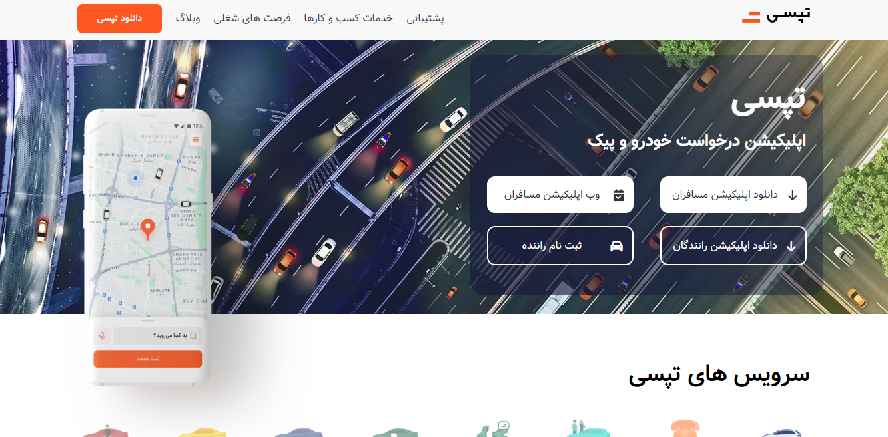

# Tapsi Website Redesign Project 🚖

## [App Online Link](https://tapsi-website-ui-redesign.netlify.app/)

## App Demo

---

## About Me

Hi Dear Developers👋, My Name is Farzin Khosravi, Welcome to My First Repository, I Hope You will Enjoy and Use this Project to the Fullest, I will be Happy to Share your Comments with Me.

Wait for Interesting Front-end Projects.😊

## Description

This Project is a Redesign of the User Interface(UI) of the Tapsi Website, which is Responsive in the Screen Sizes of Different Devices;

With the Difference that in This Project, Changes (With the Details and Excellent User Experience(UX)) have been Made in the User Interface, Which Include the Following:

- Special Tariff Section for Customers (Plan-Block Section)
- Best Driver Awards (Travel Section)
- Choosing a Driver (Radio Button Section)
- Driver's Records (Accordion Section)
- Contact Us (Contact Us Section)

## Features

- Creating a hamburger menu (JS)
- Creating an accordion menu (JS)
- Responsiveness of photos using the media attribute (in HTML)
- Creating a Scroll by Clicking and Dragging in the Tab Section of Tapsi Services(Services Section) and Best Driver Awards (Travel Section) (JS)

## Tips 📌

- Fully Responsive for Mobile, Tablet, Laptop and Desktop.
- BEM Convention
- Object-Oriented-CSS
- CSS Variables

## Web Development Technologies

- HTML5 (Semantic HTML)
- Pure CSS3 (FlexBox & Grid Layout)
- Vanilla JavaScript

## Contact Me 📧

 

